# Mycat(分库分表中间件)

## 1. 数据库优化策略

1.  重启：释放资源
2.  SQL与索引
3.  表与存储引擎（字段类型选择，长度设置，是否需要分表、分区）
4.  数据库与应用架构（考虑使用缓存服务器，减轻是数据库压力；可以数据库分布式，读写分离，主从复制）
5.  数据库与操作系统配置（修改mysql配置，使用单独服务器部署数据库）
6.  硬件

## 2. 数据库演化

根据业务需要、数据量变化，随之而来的数据库的变化

1.  数据库与应用部署在同一台服务器
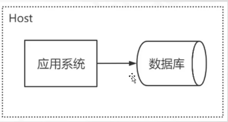
2.  单体应用架构，单数据库（数据库服务器和应用服务器分离，但是业务系统越做越大）
    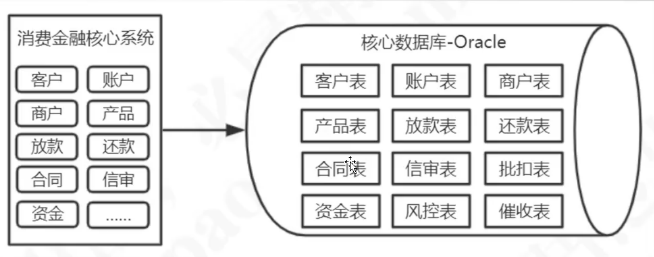

3.  多应用单数据库（应用解耦）
    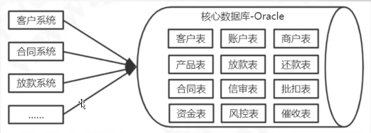

4.  多应用 独立数据库
    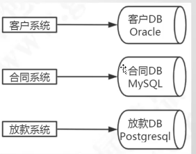

5.  但应用多数据库(分表)
    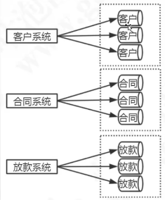

## 3. 如何分库分表
-   垂直切分
    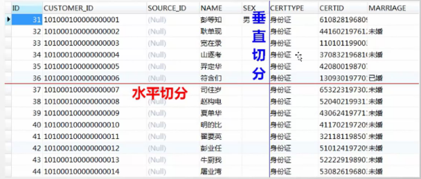

-   垂直切分

    -   单库
        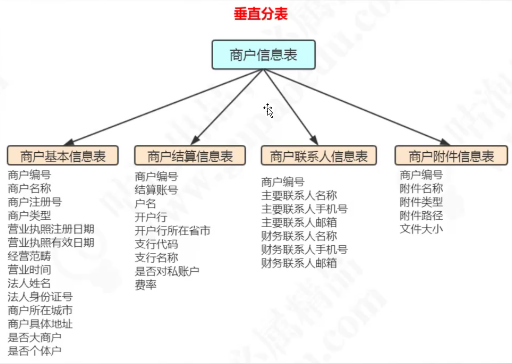

    -   多库
        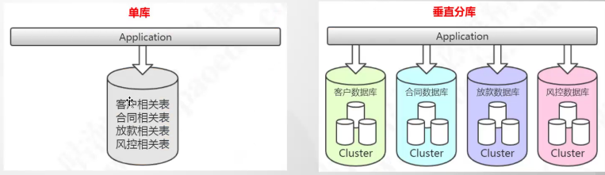

-   水平切分

    -   按照月分表或者分成实时、历史表等
        

    -   分成多库
        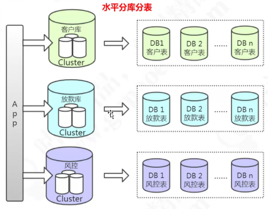

## 4. 分库分表带来的问题

1.  跨库关联查询

    -   增加冗余字段（违反了第三范式：表中的所有数据元素不但要能唯一地被主关键字所标识,而且它们之间还必须相互独立,不存在其他的函数关系）
    -   跨数据库的同步（canal、Mq（最好）、ETL、kettle、ogg）(在某个库中同步其他数据库中表的数据，避免跨库关联查询)
    -   全局表(广播表)：比如行政区划表，所有的系统都是一样的；
    -   API

2.  分布式事务

    -   Local

3.  排序、翻页、函数计算

    -

4.  全局主键

    -   雪花算法leaf
    -   redis(int 类型可以设置incby)
    -   ZookKeeper
    -   uuid(数据过长， 影响索引存储)

5.  多数据源连接（动态数据源）
    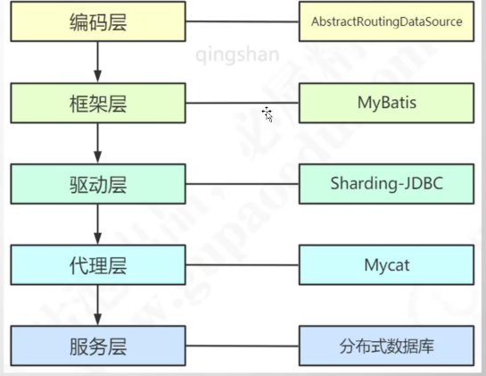

## 5. Mycat分库分表中间件

**官网地址**：http://www.mycat.org.cn/

从阿里cobar升级而来，完全实现了mysql协议，可以当作一个mysql数据库来使用，通过JDBC支持其他数据库实现分库分表，解决了**多表join、分布式事务、全局序列号、翻页查询、函数计算**的问题

*   一个彻底开源的，面向企业应用开发的大数据库集群
*   支持事务、ACID、可以替代MySQL的加强版数据库
*   一个可以视为MySQL集群的企业级数据库，用来替代昂贵的Oracle集群
*   一个融合内存缓存技术、NoSQL技术、HDFS大数据的新型SQL Server
*   结合传统数据库和新型分布式数据仓库的新一代企业级数据库产品
*   一个新颖的数据库中间件产品

华为云的DDM其实也是根据mycat做的

### 5.1 核心概念

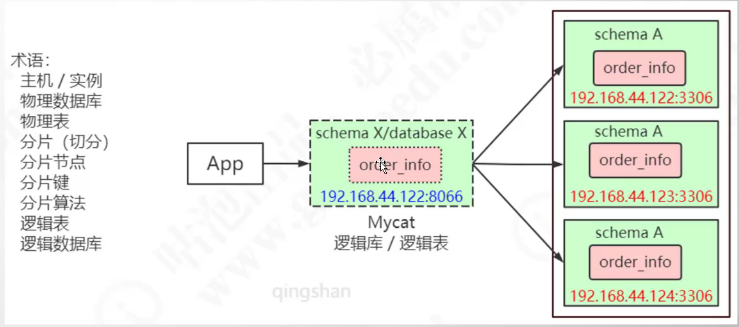

### 5.2 Mycat安装与配置

#### 5.2.1 Mycat安装

从官网下载安装版本，解压到文件(官网建议安装在/usr/local/Mycat)后页面如下图所示：
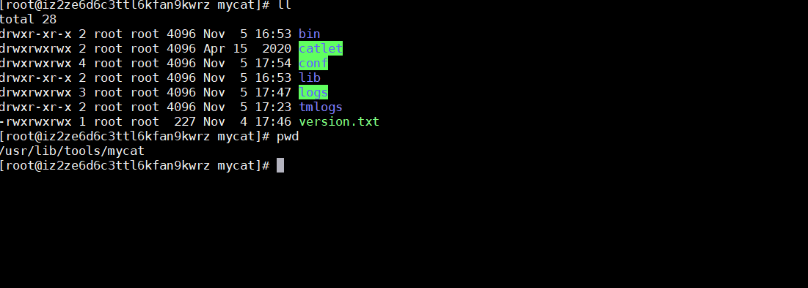

目录解释如下：

- **bin：**存放window版和linux版本除了提供封装成服务的版本之外，也提供了nowrap的shell脚本命令，方便选择和修改；Linux下运行:./mycat console， 首先要chmod + x*;(mycat支持的命令console、start、stop、restart、status、dump)
- **conf：**server.xml是mycat服务器参数调整和用户授权的配置文件，schema.xml是逻辑库定义和表以及分片定义的配置文件，rule.xml是分片规则的配置文件，分片规则的具体一些参数信息单独存放为文件，也在这个目录下，配置文件修改，需要重启mycat或者通过9066端口reload
- **lib:**主要存放mycat依赖的一些jar文件
- **logs:**日志存放在mycat.log中，每天一个文件，日志的配置是在conf/log4j.xml中，根据自己的需要，可以调整输出级别为debug，方便排查问题；注意Linux下部署安装mysql，默认不忽略，需要手动到/etc/my.cnf下配置**lower_case_table_names=1**使Linux环境下MySQL忽略表明大小写，否则使用mycat的时候会提示找不到表的错误

#### 5.2.2 服务启动与配置

Mycat在Linux中部署启动时，首先需要在Linux系统的环境变量中配置MYCAT_HOE,操作方式如下：

1. vi /etc/profile，在系统环境变量文件中增加MYCAT_HOME=/usr/lib/tools/mycat
   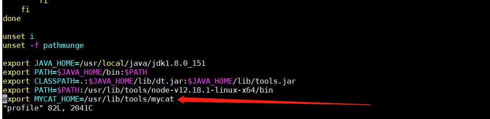

2. 执行 source/etc/profile命令，使环境变量生效。如果是多台Linux系统中组件Mycat集群，那需要在mycat Server所在的服务器配置对其他ip和主机名的映射，配置方式如下：
   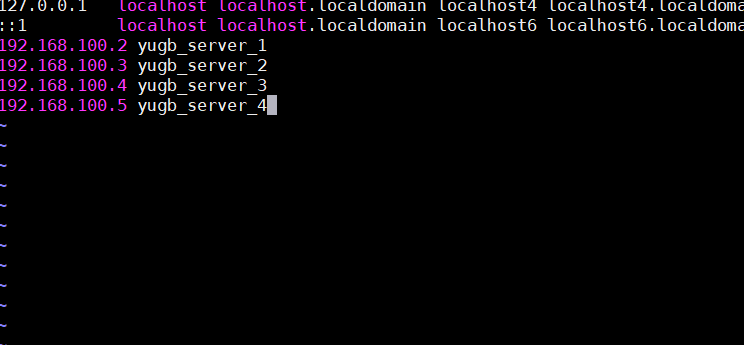

   经过以上两个步骤的配置，就可以到/usr/lib/tools/mycat/bin目录下执行./mycat start启动mycat服务；使用mycat status查看mycat的运行状态；如下图
   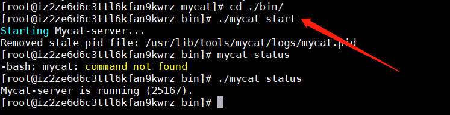

##### 5.2.2.1 安装遇到的问题

1. schema TESTDB refered by user root is not exist!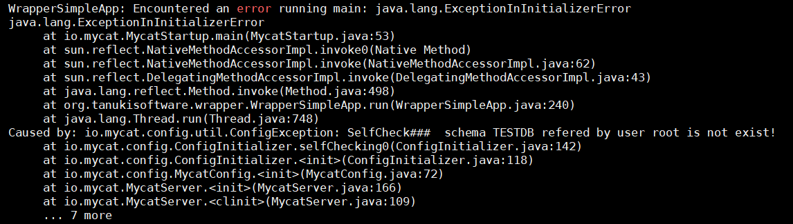

   解决方式：

    ```xml
    <!--在conf/server.xml文件中schemas中配置schema.xml文件中的schema的name值-->
    
    <!--user中的name为mycat服务的用户名-->
     <user name="root" defaultAccount="true">
         <!--这个是mycat服务连接的密码-->
          <property name="password">123456</property>
          <property name="schemas">xiaoyuge</property>
    </user>
    ```


#### 5.2.3日志分析

mycat的日志文件配置为MYCAT_HOME/conf/log4j.xml

```xml
<?xml version="1.0" encoding="UTF-8"?>
<!DOCTYPE log4j:configuration SYSTEM "log4j.dtd">
    <log4j:configuration xmlns:log4j="http://jakarta.apache.org/log4j/">
    <appender name="ConsoleAppender" class="org.apache.log4j.ConsoleAppender">
    <layout class="org.apache.log4j.PatternLayout">
    <param name="ConversionPattern" value="%d{MM-dd HH:mm:ss.SSS} %5p [%t] (%F:%L) -%m%n" />
	</layout>
	</appender>
	<appender name="FILE" class="org.apache.log4j.RollingFileAppender">
        <!--日志文件存放的目录-->
        <param name="file" value="${MYCAT_HOME}/logs/mycat.log" />
        <param name="Append" value="false"/>
        <param name="MaxFileSize" value="10000KB"/>
        <param name="MaxBackupIndex" value="10"/>
        <param name="encoding" value="UTF-8" />
        <layout class="org.apache.log4j.PatternLayout">
        <param name="ConversionPattern" value="%d{MM/dd HH:mm:ss.SSS} %5p [%t] (%F:%L) -%m%n" />
	</layout>
	</appender>
	<root>
        <!--level是日志级别，生产环境下加以将级别调整为info/ware，如果是研究测试，碰到异常设置为debug-->
		<level value="debug" />
		<appender-ref ref="ConsoleAppender" />
	</root>
</log4j:configuration>
```

##### 5.2.3.1 warpper日志

目前mycat的启动时经过warpper封装成启动脚本，所以日志也会有其相关的日志文件：${MYCAT_HOME}/logs/warapper.log， 在启动的时候如果系统环境配置错误或缺少配置时，导致mycat无法启动，可以通过查看wrapper.log查看具体错误原因。

1. 正常启动

    ```verilog
    STATUS | wrapper | 2015/04/12 15:05:00 | --> Wrapper Started as Daemon
    STATUS | wrapper | 2015/04/12 15:05:00 | Launching a JVM...
    INFO | jvm 1 | 2015/04/12 15:05:01 | Wrapper (Version 3.2.3) http://wrapper.tanukisoftware.org
    INFO | jvm 1 | 2015/04/12 15:05:01 | Copyright 1999-2006 Tanuki Software, Inc. AllRights Reserved.
    INFO | jvm 1 | 2015/04/12 15:05:01 |
    INFO | jvm 1 | 2015/04/12 15:05:01 | log4j 2015-04-12 15:05:01 [./conf/log4j.xml]load completed.
    INFO | jvm 1 | 2015/04/12 15:05:02 | MyCAT Server startup successfully. see logs in logs/mycat.log
    ```

2. 启动异常

    ```verilog
    STATUS | wrapper | 2015/02/14 01:43:44 | --> Wrapper Started as Daemon
    STATUS | wrapper | 2015/02/14 01:43:44 | Launching a JVM...
    INFO | jvm 1 | 2015/02/14 01:43:45 | Error: Exception thrown by the agent : java.rmi.server.ExportException:
    Port already in use: 1984; nested exception is:
    INFO | jvm 1 | 2015/02/14 01:43:45 | java.net.BindException: Address already in use
    ERROR | wrapper | 2015/02/14 01:43:45 | JVM exited while loading the application.
        
    # 日志显示异常原因为 java.net.BindException: Address already in use,也就是端口占用，很有可能是原有服
    务未停止，或者 Mycat 默认端口被其他程序占用，正常启动成功后会有 mycat.log 日志，如果服务未启动成功不会有对应的日志。 也可以去修改 conf 文件夹里的 wrapper.conf 里的 wrapper.java.additional.7=-Dcom.sun.management.jmxremote.port=1984，server.xml 的<property name="serverPort">8066</property>和
    <property name="managerPort">9066</property>，这方法适
    合一台机器上两个 mycat 或者 1984,8066,9066 端口被其它应用占用的情况
    ```


##### 5.2.3.2 mycat日志


#### 5.2.4 mycat防火墙设置

白名单和SQL黑名单说明：

```xml
<!--在 server.xml 中配置：-->
<firewall>
     <!--ip 白名单列表，可以配置多个-->
    <whitehost>
        <!--ip 白名单 用户对应的可以访问的 ip 地址-->
    	<host user="mycat" host="127.0.0.1"></host> 
    </whitehost>
     <!-是否开启检查黑名单列表-->
    <blacklist check="true">
        <!--黑名单允许的 权限 后面为默认-->
    	<property name="selelctAllow">false</property>
    </blacklist>
</firewall>
```

**黑名单配置拦截明细如下：**

|         配置项         | 缺省值 |                             描述                             |
| :--------------------: | :----: | :----------------------------------------------------------: |
|     rollbackAllow      |  true  | 是否允许执行 roll back 操作,如果把 selectIntoAllow、deleteAllow、updateAllow、insertAllow、mergeAllow 都设置为 false，这就是一个只读数据源了。 |
|      selectAllow       |  true  |                    是否运行执行SELECT语句                    |
|  selectAllColumnAllow  |  true  | 是否允许执行 SELECT * FROM T 这样的语句。如果设置为 false，不允许执行 select * from t，但 select * from (select id, name from t) a。这个选项是防御程序通过调用 select *获得数据表的结构信息 |
|    selectIntoAllow     |  true  |               SELECT 查询中是否允许 INTO 字句                |
|      deleteAllow       |  true  |                   是否允许执行 DELETE 语句                   |
|      updateAllow       |  true  |                   是否允许执行 UPDATE 语句                   |
|      insertAllow       |  true  |                   是否允许执行 INSERT 语句                   |
|      replaceAllow      |  true  |                  是否允许执行 REPLACE 语句                   |
|       mergeAllow       |  true  |       是否允许执行 MERGE 语句，这个只在 Oracle 中有用        |
|       callAllow        |  true  |          是否允许通过 jdbc 的 call 语法调用存储过程          |
|        setAllow        |  true  |                    是否允许使用 SET 语法                     |
|     truncateAllow      |  true  |        truncate 语句是危险，缺省打开，若需要自行关闭         |
|    createTableAllow    |  true  |                        是否允许创建表                        |
|    alterTableAllow     |  true  |                是否允许执行 Alter Table 语句                 |
|     dropTableAllow     |  true  |                        是否允许修改表                        |
|      commentAllow      | false  | 是否允许语句中存在注释，Oracle 的用户不用担心，Wall 能够识别 hints和注释的区别 |
| noneBaseStatementAllow | false  | 是否允许非以上基本语句的其他语句，缺省关闭，通过这个选项 就能够屏蔽 DDL。 |
|  multiStatementAllow   | false  |              是否允许一次执行多条语句，缺省关闭              |
|        useAllow        |  true  |           是否允许执行 mysql 的 use 语句，缺省打开           |
|     describeAllow      |  true  |        是否允许执行 mysql 的 describe 语句，缺省打开         |
|       showAllow        |  true  |          是否允许执行 mysql 的 show 语句，缺省打开           |
|      commitAllow       |  true  |                   是否允许执行 commit 操作                   |

**拦截配置=-永真条件：**

|           配置项            | 缺省值 |                             描述                             |
| :-------------------------: | :----: | :----------------------------------------------------------: |
|  selectWhereAlwayTrueCheck  |  true  |       检查 SELECT 语句的 WHERE 子句是否是一个永真条件        |
| selectHavingAlwayTrueCheck  |  true  |       检查 SELECT 语句的 HAVING 子句是否是一个永真条件       |
|  deleteWhereAlwayTrueCheck  |  true  |       检查 DELETE 语句的 WHERE 子句是否是一个永真条件        |
|    deleteWhereNoneCheck     | false  | 检查 DELETE 语句是否无 where 条件，这是有风险的，但不是 SQL 注入类型的风险 |
|  updateWhereAlayTrueCheck   |  true  |       检查 UPDATE 语句的 WHERE 子句是否是一个永真条件        |
|    updateWhereNoneCheck     | false  | 检查 UPDATE 语句是否无 where 条件，这是有风险的，但不是SQL 注入类型的风险 |
| conditionAndAlwayTrueAllow  | false  |    检查查询条件(WHERE/HAVING 子句)中是否包含 AND 永真条件    |
| conditionAndAlwayFalseAllow | false  |    检查查询条件(WHERE/HAVING 子句)中是否包含 AND 永假条件    |
|   conditionLikeTrueAllow    |  true  |   检查查询条件(WHERE/HAVING 子句)中是否包含 LIKE 永真条件    |

**其他拦截配置：**

|          配置项           | 缺省值 |                             描述                             |
| :-----------------------: | :----- | :----------------------------------------------------------: |
|  selectIntoOutfileAllow   | false  | SELECT ... INTO OUTFILE 是否允许，这个是 mysql 注入攻击的常见手段，缺省是禁止的 |
|     selectUnionCheck      | true   |                      检测 SELECT UNION                       |
|     selectMinusCheck      | true   |                      检测 SELECT MINUS                       |
|     selectExceptCheck     | true   |                      检测 SELECT EXCEPT                      |
|   selectIntersectCheck    | true   |                    检测 SELECT INTERSECT                     |
|     mustParameterized     | false  | 是否必须参数化，如果为 True，则不允许类似 WHERE ID = 1 这种不参数化的 SQL |
|     strictSyntaxCheck     | true   | 是否进行严格的语法检测，Druid SQL Parser 在某些场景不能覆盖所有的，SQL 语法，出现解析 SQL 出错，可以临时把这个选项设置为 false，同时把 SQL 反馈给 Druid 的开发者 |
|    conditionOpXorAllow    | false  | 查询条件中是否允许有 XOR 条件。XOR 不常用，很难判断永真或者永假，缺省不允许。 |
|  conditionOpBitwseAllow   | true   |               查询条件中是否允许有"&"、"~"、"                |
| conditionDoubleConstAllow | false  |           查询条件中是否允许连续两个常量运算表达式           |
|        minusAllow         | true   |  是否允许 SELECT * FROM A MINUS SELECT * FROM B 这样的语句   |
|      intersectAllow       | true   | 是否允许 SELECT * FROM A INTERSECT SELECT * FROM B 这样的语句 |
|   constArithmeticAllow    | true   | 拦截常量运算的条件，比如说 WHERE FID = 3 - 1，其中"3 - 1"是常量运算表达式。 |
|      limitZeroAllow       | false  |                 是否允许 limit 0 这样的语句                  |

**禁用对象检测配置：**

|     配置项     | 缺省值 |                             描述                             |
| :------------: | :----: | :----------------------------------------------------------: |
|   tableCheck   |  true  |                    检测是否使用了禁用的表                    |
|  schemaCheck   |  true  |                 检测是否使用了禁用的 Schema                  |
| functionCheck  |  true  |                   检测是否使用了禁用的函数                   |
|  objectCheck   |  true  |                  检测是否使用了“禁用对对象”                  |
|  variantCheck  |  true  |                  检测是否使用了“禁用的变量”                  |
| readOnlyTables |   空   | 指定的表只读，不能够在 SELECT INTO、DELETE、UPDATE、INSERT、MERGE 中作为"被修改表"出现 |

#### 5.2.5 mycat配置文件

##### 5.2.5.1 schema.xml配置

schema.xml作为mycat中重要的配置文件之一，管理者mycat的逻辑库、表、分片规则、DataNode以及DataSource。

##### 5.2.5.2 scheme标签

```xml
<schema name="TESTDB" checkSQLschema="false" sqlMaxLimit="100"></schema>
```

schema标签用于定义mycat实例中的逻辑库，mycat可以由多个逻辑库，每个逻辑库都有自己的相关配置，可以使用schema标签来划分这些不同的逻辑库。如果不配置schema标签，所有的表配置，会属于同一个默认的逻辑库。

```xml
<!--逻辑库TESTDB-->
<schema name="TESTDB" checkSQLschema="false" sqlMaxLimit="100">
	<table name="travelrecord" dataNode="dn1,dn2,dn3" rule="auto-sharding-long" ></table>
</schema>
<!--USERDB-->
<schema name="USERDB" checkSQLschema="false" sqlMaxLimit="100">
	<table name="company" dataNode="dn10,dn11,dn12" rule="auto-sharding-long" ></table>
</schema>
<!--
	逻辑库的概念和MySQL数据库中的database概念相同，我们在查询这两个不同的逻辑库中表的时候需要切换到该逻辑库下才可以查询到所需要的表
-->
```

在server.xml中可以配置不同的用户能够使用的schema

```xml
        <user name="root" defaultAccount="true">
                <property name="password">root</property>
                <property name="schemas">TESTDB</property>
                <property name="defaultSchema">TESTDB</property>
                <!--No MyCAT Database selected 错误前会尝试使用该schema作为schema，不设置则为null,报错 -->

                <!-- 表级 DML 权限设置 -->
                <!--
                <privileges check="false">
                        <schema name="TESTDB" dml="0110" >
                                <table name="tb01" dml="0000"></table>
                                <table name="tb02" dml="1111"></table>
                        </schema>
                </privileges>
                 -->
        </user>

        <user name="user">
                <property name="password">user</property>
                <property name="schemas">TESTDB</property>
                <property name="readOnly">true</property>
                <property name="defaultSchema">TESTDB</property>
        </user>

```
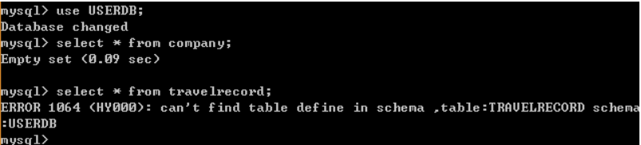

schema标签的相关属性：

|     属性名     |     值     | 数量限制 |
| :------------: | :--------: | :------: |
|    dataNode    | 任意string | （0..1） |
| checkSQLschema |  Boolean   |  （1）   |
|  sqlMaxLimit   |  Integer   |  （1）   |

###### 5.2.5.2.1  dataNode

该属性用于绑定逻辑库到某个具体的database上，1.3版本如果配置了dataNode,则不可以配置分片表，1.4可以配置默认分片，只需要配置需要分片的表即可，具体配置如下：

```xml
<!--1.3版本配置--><schema name="USERDB" checkSQLschema="false" sqlMaxLimit="100" dataNode="dn1"><!—里面不能配置任何表--></schema><!--1.4版本配置--><schema name="USERDB" checkSQLschema="false" sqlMaxLimit="100" dataNode="dn2"><!—配置需要分片的表-->	<table name=“tuser” dataNode=”dn1”/></schema><!-- 	那么现在tuser就绑定到dn1所配置的具体database上，可以直接访问这个database，没有配置的表则会走默认的节点dn2，这里注意没有配置在分片里面的表工具查看无法显示，但是可以正常使用。-->
```

###### 5.2.5.2.2 checkSQLschema

当改制设置为true时，我们执行“SELECT * FROM TESTDB.travelrecord；”则mycat会把语句修改为“SELECT * FROM travelrecord;”即把表示schema的字符去掉，避免发送到后端数据库执行报ERROR 1146：Table 'testdb.travelrecord' doest't exist.不过，即使设置该值为 true ，如果语句所带的是并非是 schema 指定的名字，例如：**select * from db1.travelrecord;** 那么 MyCat 并不会删除 db1 这个字段，如果没有定义该库的话则会报错，所以在提供 SQL语句的最好是不带这个字段。

###### 5.2.5.2.3 sqlMaxLimit

当该值设置为某个数值时。每条执行的 SQL 语句，如果没有加上 limit 语句，MyCat 也会自动的加上所对应的值。例如设置值为 100，执行**select * from TESTDB.travelrecord;**的效果为和执行**select * from TESTDB.travelrecord limit 100;**相同。

设置该值的话，MyCat 默认会把查询到的信息全部都展示出来，造成过多的输出。所以，在正常使用中，还是建议加上一个值，用于减少过多的数据返回。

当然 SQL 语句中也显式的指定 limit 的大小，不受该属性的约束。

需要注意的是，如果运行的 schema 为非拆分库的，那么该属性不会生效。需要手动添加 limit 语句。

### 5.2 分配规则

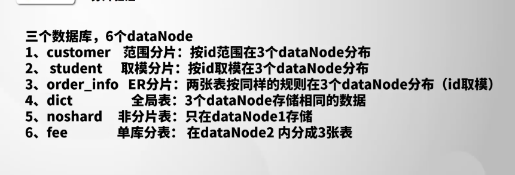
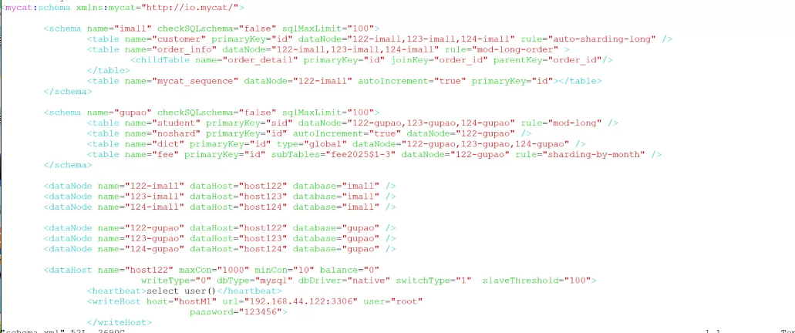

-   范围分片：根据某个字设置auto-sharding-long，如果这个primaryKey超出了范围会报错

-   取模分片：

-   ER分片（将父子表有关联的数据放在一个data-node里面）

    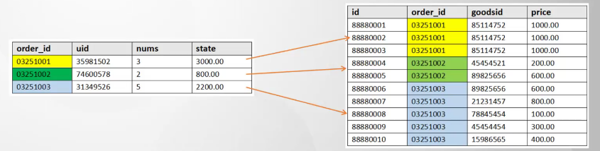

-   全局表：所有dataNode存储相同的数据，查询的时候是随机查询某个表 type=global，查询的时候随机从某个datanode获取

-   非分片表：只在某个dataNode上存储,指定一个dataNode并且不写分片规则

-   单库分表：有个bug在实际数据库中必须要创建mycat中一摸一样的数据表，而且truncat的时候要现在dataNode先删除，才能删除的掉mycat的数据


### 5.3 全局ID


-   文件方式---0
-   数据库方式---1
-   本地时间戳----2
-   ZK方式----3

## 6. Mycat分片策略详解

连续分片与离散分片

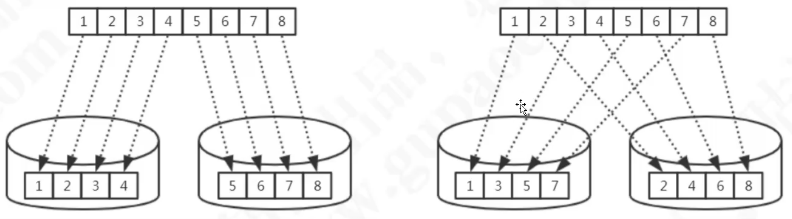

**连续分片**：

-   范围分片
-   日期/事件


缺点：

-   存在数据热点的可能性
-   并发访问能力受限于单一或少量DataNode（访问集中），并不能分摊数据库访问的压力

**离散**：

-   取模（partioncount 的总数必须和分片总数相同）

-   枚举

-   一致性哈希(qs-murmur)

-   固定分片哈希

    -   partitionCount: 2, 1表示有三个分片必须和节点数量一致，否则会报错，前面两个一样长

    -   partitionLength: 256, 512表示长度为256和512

    -   综合在一起就是前面2个分片长度为256， 最后一个为512，结果如下图所示（注意partitionCount和partitionLength的数量一定要一致）

    -   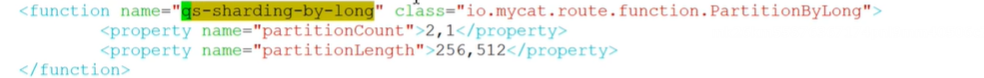

        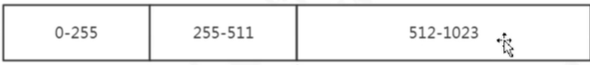

-   取模范围(sharting-by-pattern)：先取模PartitionByPattern后分片

-   范围取模: PartitionByRangeMod(partition-rane-mod.txt)

    -   ```txt
        0-2000=1		#范围在2000以内的在第一个节点（取模的结果还是本身）
        2001-4000=2		#范围在2001到4000以内的再模2，结果为0在第一个节点，结果为1在第三个节点
        ```

-   其他

优点：

-   并发访问能力增强（负载到不同的节点）
-   范围条件查询性能提升（并行计算）

缺点：

-   数据扩容比较困难，设计到数据迁移问题
-   数据库连接消耗比较多

分片策略的选择：

1） 确定分片表

2） 找出分片键

3） 考虑容量、增速、业务用户

如果在查询语句中没有携带分片建，那么mycat会将sql发布到所有的节点上

## 7. Mycat扩缩容

### 7.1 在线不停机扩缩容（双写）

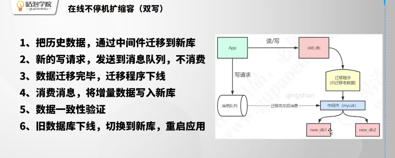


### 7.2 离线扩缩容

#### 7.2.1Mysql Dump

```shell
mysqldump -uroot -p123456 -h127.0.0.1 -p3306 -c -t --skip-extended-insert 数据库名称 > mysql.11.11.sql
```

#### 7.2.2 Mycat自带工具

1.  mycat所在环境安装mysql客户端程序
2.  mycat的lib目录下添加mysql的jdbc驱动包（mysql-connector-java-5.7.1.jar）
3.  对扩容缩容的表所有节点数据进行备份
4.  复制schema.xml、rule.xml并重命名为newSchema.xml、newRule.xml
5.  修改newSchema.xml和newRule.xml配置文件为扩容缩容后的参数
6.  在conf/migrateTable.properties配置文件中配置分片库和分片表如：imall=table_test1
7.  dataMigrate.sh配置mysqldump路径
8.  停止mycat服务
9.  执行bin/dataMigrate.sh脚本（不能用openjdk）
10.  替换schema.xml、rule.xml


**注意事项：**

-   保证分片表迁移数据前后路由规则一致（取模-->取模）
-   保证分片表歉意数据前后分片字段一致
-   全局表将被忽略
-   不要将非分片表配置到migrateTables.properties文件中
-   暂时只支持分片表使用Mysql作为数据源的扩容缩容

## 8. Mycat读写分离

### 8.1 主从复制

1.  数据备份回复
2.  负载均衡（读写分离）
3.  高可用HA

### 8.2 主从复制形式;

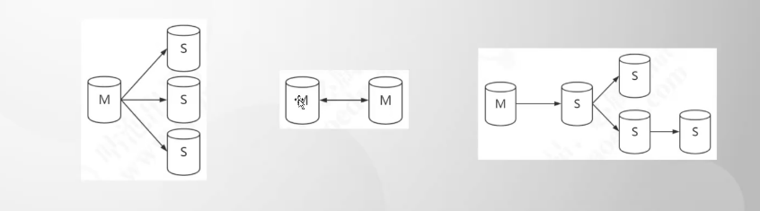

#### binlog(Binary log 二进制日志)

```sql
--查看binglog: SHOW binlog events in 'mysql-bin.000001'
--show variables like 'max_blog_max'
```

#### binlog配置

-   STATEMENT: 记录每一天修改数据的sql语句（减少日志量，节约IO）
-   ROW: 记录哪条数据被修改了，修改成什么样子了（5.7以后默认）
-   MIXED: 结合两种方式，一般语句用STATEMENT,函数之类的使用ROW

**binlog**格式（mysql-bin.00001等）

**查看binlog**

```sql
show binlog events in 'mysql-bin.00001';
```

### 主从复制原理

SQL Thread是单线程的， 这也是所有的主从复制延迟的原因，那么relay log接受master节点的sql语句主要是用于缓冲

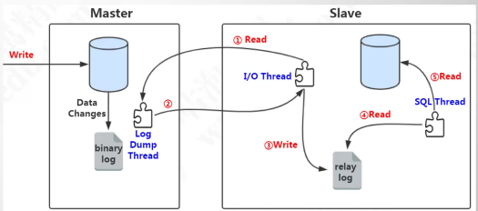

### mycat读写分离配置

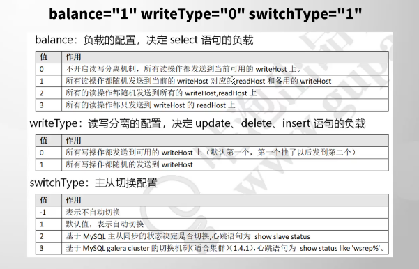

### 8.5 Mycat注解（hint）

注解用法：

```tex
	/*!mycat:sql=注解sql语句*/真正执行的SQL
	
	比如说在mycat上创建表无法创建成功，可以使用注解
	/*!mycat:sql=select * from table_1 where id = 1*/create table test2(id int);
	主要注解sql可以确认mycat可以路由到子结点上，就可以执行后面的真正执行的sql语句
```

注解用途：

-   跨库关联查询
-   DDL或存储过程
-   自定义分片
-   读写分离

### 分布式事务

基于XA协议的两阶段提交

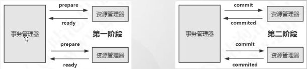

#### XA角色

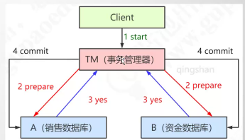

#### XA实现

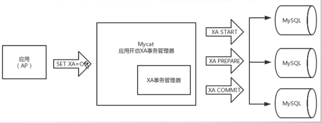


## 9. Mycat核心流程

### 9.1 架构图

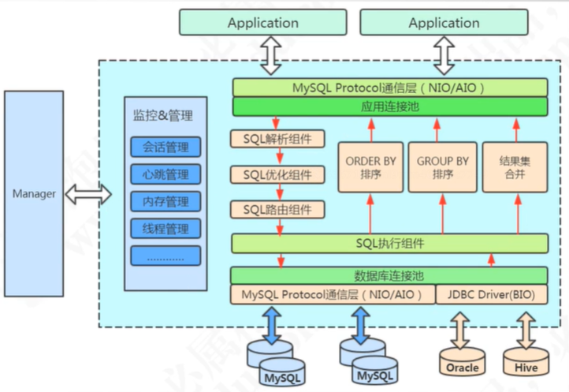

### 9.2 启动流程

1.  MycatServer启动，解析配置文件，包括服务器、分片规则等
2.  创建工作线程，建立前端连接和后端连接

### 9.3 执行SQL流程

1.  前端连接接收mysql命令
2.  解析MySQL，mycat用的是Druid的DruidParser
3.  获取路由
4.  改写MySQL，例如两个条件在两个节点上，则变成两条单独的sql
5.  与后端数据库建立连接
6.  发送sql语句到MySQL执行
7.  获取返回结果
8.  处理返回结果，例如排序、计算等等
9.  返回给客户端


## Mycat高可用

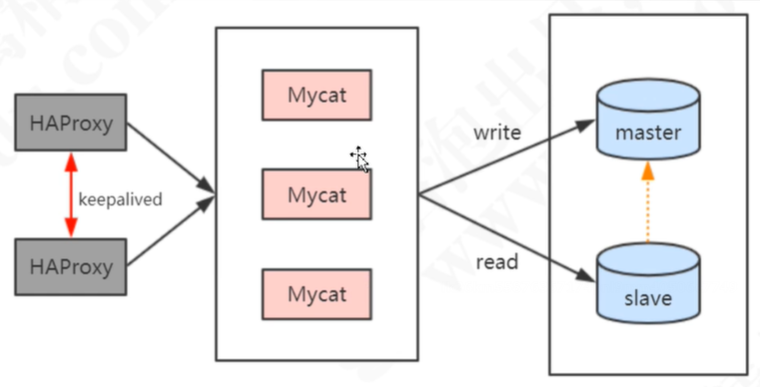

