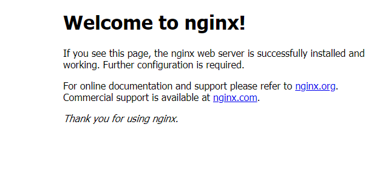

# Nginx安装

1. 安装nginx前首先要确认系统中是否安装了gcc 、pcre-devel、zlib-devel、openssl-devel

    ```shell
    #1、rpm包安装的，可以用 rpm -qa 看到，如果要查找某软件包是否安装，用 rpm -qa | grep "软件或者包的名字"
    #2、以deb包安装的，可以用 dpkg -l 看到。如果是查找指定软件包，用 dpkg -l | grep "软件或者包的名字"
    #3、yum方法安装的，可以用 yum list installed 查找，如果是查找指定包，用 yum list installed | grep "软件名或者包名"
    yum list installed | grep "gcc"
    ```
   
2. 安装依赖包

    ```shell
    yum -y install gcc pcre-devel zlib-devel openssl openssl-devel
    ```

3. 下载并解压安装包

    ```shell
    //创建nginx存放文件夹
    cd /usr/local
    mkdir nginx
    cd nginx
    #下载tar包
    wget http://nginx.org/download/nginx-1.13.7.tar.gz
    tar -xvf nginx-1.13.7.tar.gz
    ```

4. 配置

    ```shell
    cd nginx-1.13.7
    ./configure --prefix=/usr/local/nginx
    
    make
    make install
    ```

5. 测试是否安装成功

    ```shell
    ./sbin/nginx -t
    ```

    

6. 配置nginx.conf

    ```yml
    vim /usr/local/nginx/cong/nginx.conf
    
    #修改如下
    server {
      listen 80;
      server_name localhost;
    
      # 注意设定 root路径是有dist的
      location / {
        root /usr/local/webapp/dist;
        index /index.html;
      }
    
      #跨域 ip和port自行替换
      location /adminApi {
        proxy_pass http://ip:port;
      }
    
    }
    
    ```

7. 启动
   ```shell
       #启动nginx
       cd /usr/local/nginx/sbin
       ./nginx 
     ```

   **常用命令：**
   
   ```shell
       #修改配置后重新启动
       ./nginx -s reload
       #如果出现：nginx: [error] open() ＂/usr/local/nginx/logs/nginx.pid＂ failed
       /usr/local/nginx/sbin/nginx -c /usr/local/nginx/conf/nginx.conf
       #再次启动即可
       
       #查看nginx进程是否启动
       ps -ef|grep nginx
       
       #平滑启动nginx
       kill -HUP
       #主进程号或进程号文件路径 或者使用
       
       /usr/nginx/sbin/nginx -s reload
       
       #注意，修改了配置文件后最好先检查一下修改过的配置文件是否正 确，以免重启后Nginx出现错误影响服务器稳定运行。
       #判断Nginx配置是否正确命令如下：
       nginx -t -c /usr/nginx/conf/nginx.conf
       #或者使用
       /usr/nginx/sbin/nginx -t
       
       #重启
       nginx reload
       /usr/local/nginx/sbin/nginx -s reload 
       service nginx restart
       
       #启动
       ./nginx
       #关闭
       ./nginx -s stop
       
       
       #配置nginx开机自启动
       vim /etc/rc.d/rc.local
       
       #再文件中添加nginx启动地址
        
       touch /var/lock/subsys/local
       /usr/local/redis/bin/redis-server /usr/local/redis/etc/redis.conf
       
       #设置开机自启动nginx
       /usr/local/nginx/sb/nginx
    ```



